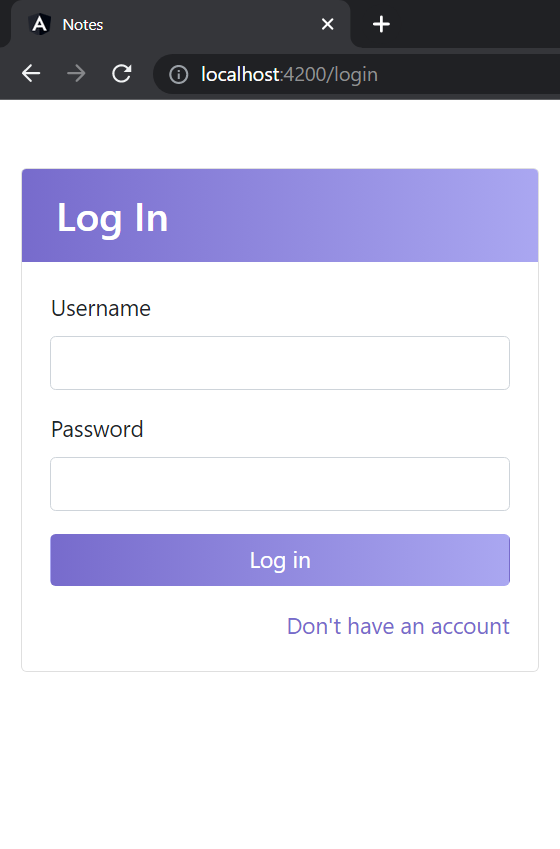
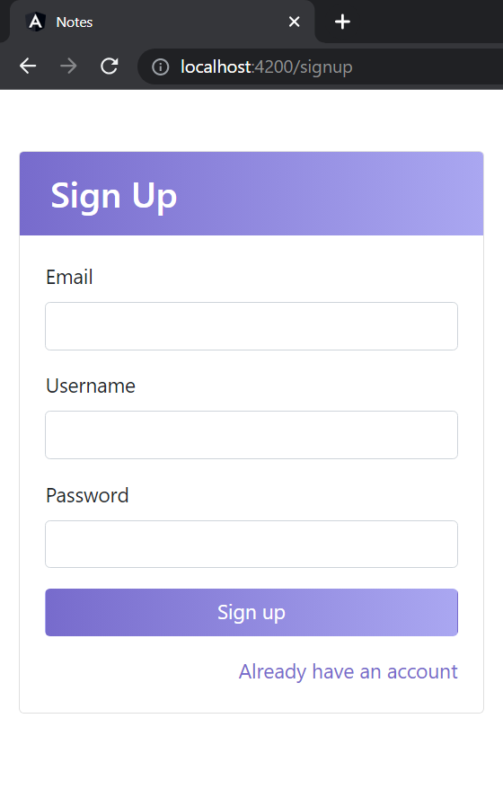
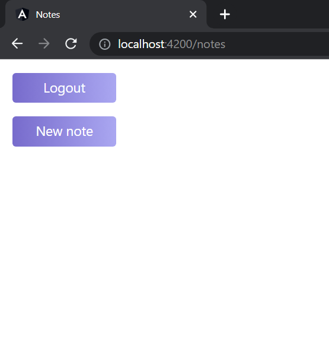
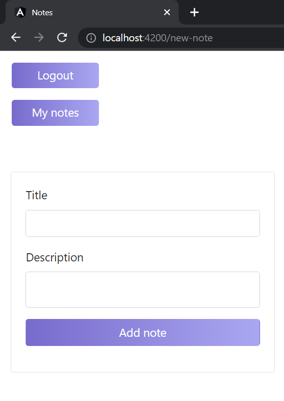

# Notes

## 🚀 Prerequisites

<ul>
    <li>Angular</li>
    <li>Go</li>
    <li>PostgreSQL</li>
</ul>

## 👨‍💻 Setting up
[](https://pkg.go.dev/github.com/json-iterator/go)
<details>
To run the backend execute the following command in the terminal:

```sh
go run .
```
</details>

[](https://github.com/ellerbrock/javascript-badges/) <br>
[](https://www.github.com/angular/angular)
<details>
To run the frontend execute the following command in the terminal:

```sh
// go to localhost:4200
ng serve
```

or simply
```sh
ng serve --open
```

</details>

## Content
### **Login screen**

<br />

### **Signup screen**

<br />

### **Notes screen**

<br />

### **New note screen**

<br />
